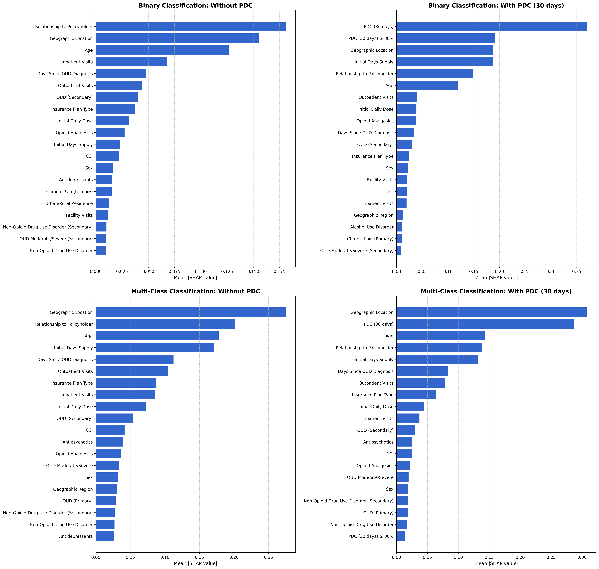
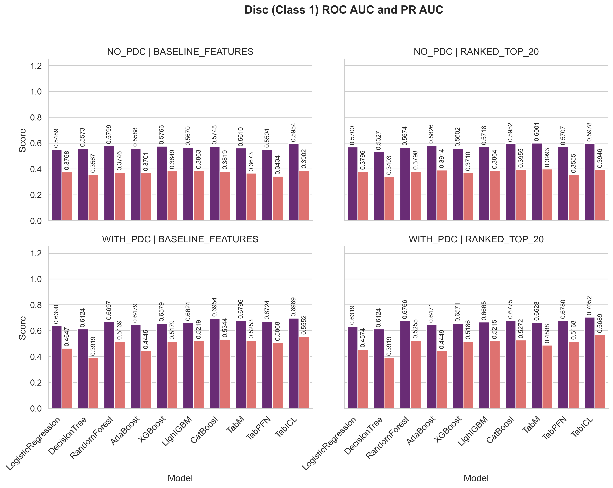
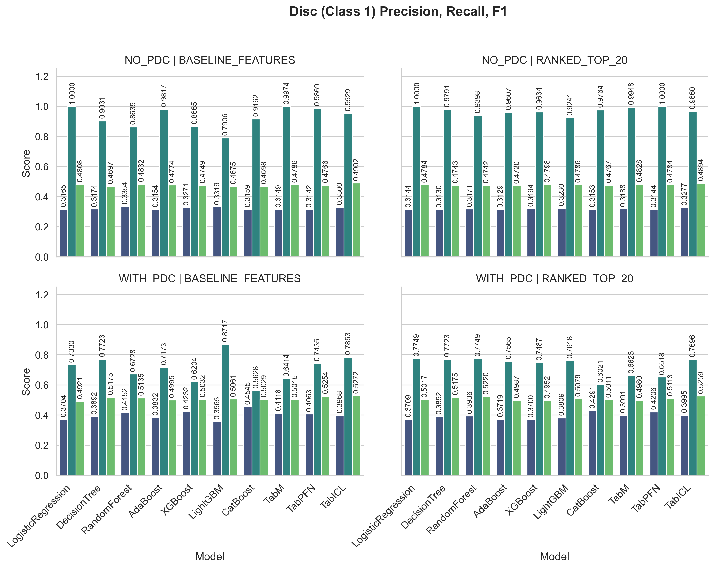
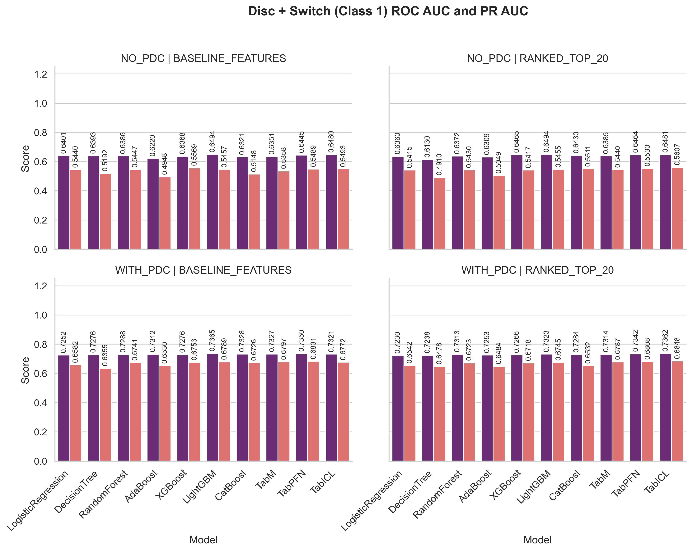
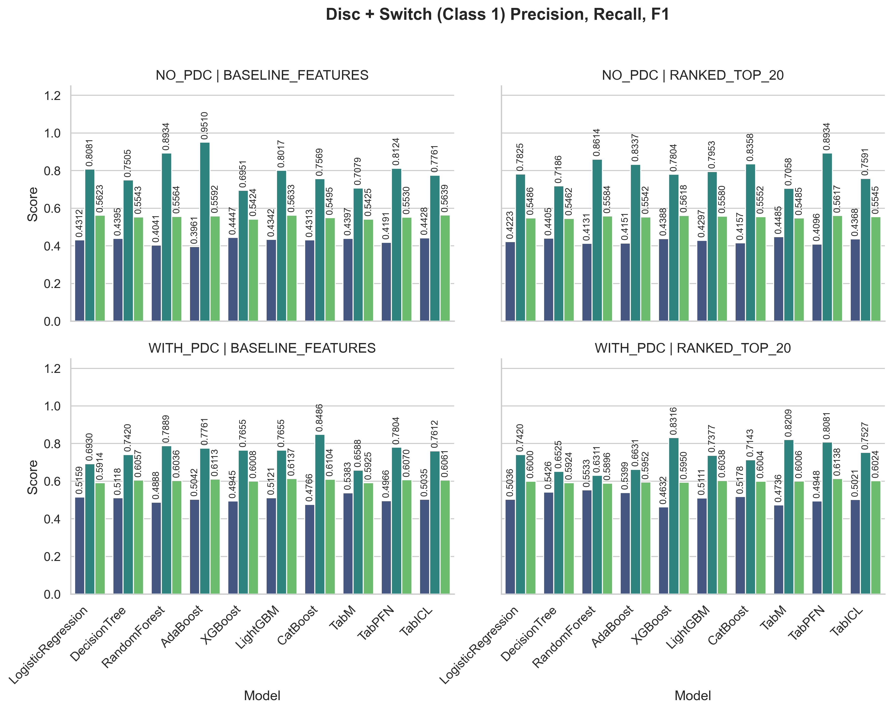
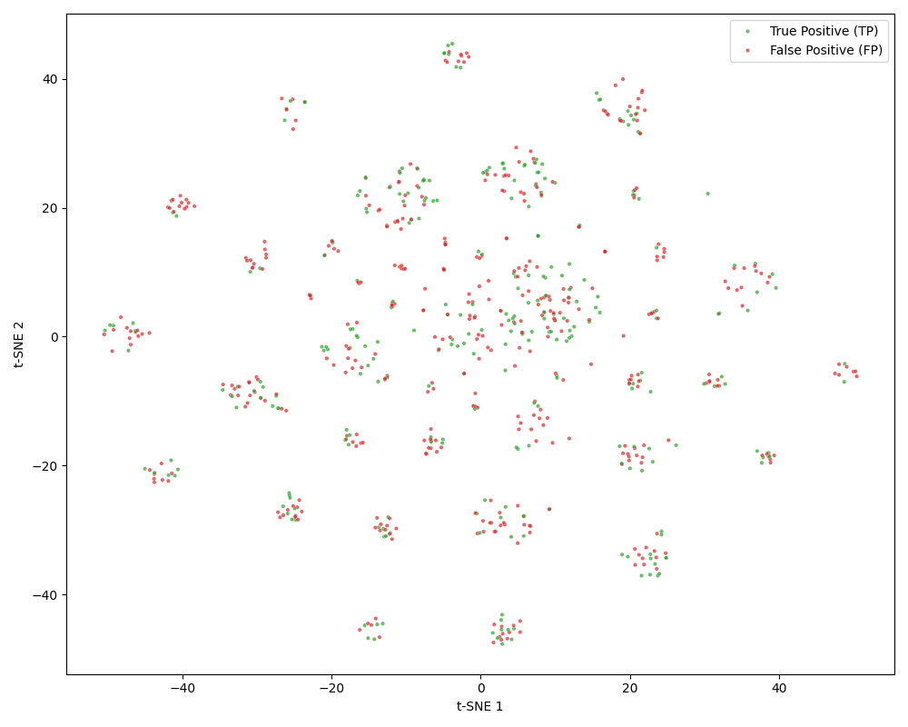

# Predicting Buprenorphine Treatment Discontinuation and Switching in Opioid Use Disorder

This repository contains the code and supplementary material for the paper **"Predicting Buprenorphine Treatment Discontinuation and Switching in Opioid Use Disorder"**.

## Overview

Discontinuing buprenorphine treatment for Opioid Use Disorder (OUD) significantly increases the risk of overdose. Existing predictive models often fail to distinguish between patients who **drop out** of treatment entirely and those who safely **switch** to alternative medications (e.g., methadone).

---

## Data Availability

The raw claims data used in this study (IBM MarketScan 2018–2022) are not publicly available due to licensing restrictions.

To run the pipeline, users must obtain access to MarketScan (or a similarly structured claims dataset).

We provide:
- Cohort construction logic
- Feature engineering code
- Model training and evaluation scripts

---

## Project Structure

This repository is organized as follows:

```
Predicting-Buprenorphine-Treatment-Discontinuation-and-Switching-in-Opioid-Use-Disorder/
├── src/                      # Source code for the project
│   ├── pipeline.py           # Main pipeline logic (cohort selection)
│   ├── data_preprocessing.py # Data preprocessing
│   ├── TabICL.py             # TabICLv2 implementation
│   ├── TabM.py               # TabM implementation
│   ├── TabPFN.py             # TabPFNv2.5 implementation
│   ├── catboost_model.py     # CatBoost implementation
│   ├── lightgbm_model.py     # LightGBM model implementation
│   ├── xgboost_model.py      # XGBoost model implementation
│   ├── sklearn_models.py     # scikit-learn model wrappers
│   ├── preprocessing.py      # Preprocessing logic
│   ├── config.py             # Configuration settings
│   ├── model_utils.py        # Model utility functions
│   ├── training.py           # Training loop logic
│   ├── optuna_optimizer.py   # Optuna hyperparameter optimization
│   ├── main.py               # Main execution script
│   ├── replot_shap.py        # Script to replot SHAP values
│   └── evaluate_and_analyze_saved_models.py # Script to evaluate saved models
├── results/                  # Contains all raw results
│   ├── pipeline_results.txt  # Pipeline result logs
│   ├── model_results.xlsx    # Detailed model results in Excel format
│   ├── shap/                 # SHAP Feature Importance (CSV data & plots)
│   └── plots/                # Generated plots
│       ├── calibration_and_risk_plots/
│       ├── curve_plots/
│       ├── error_analysis/   # Error Analysis (t-SNE, UMAP)
│       └── disc_class1_plots/
├── README.md                 # Project documentation
└── requirements.txt          # Python dependencies
```

> **Note:** For a complete set of results, including calibration, risk stratification plots, error analysis, SHAP feature importance, and complete model metrics, please refer to the [`results/`](results/) folder in this repository.

---

## SHAP Feature Importance

The following plot illustrates the feature importance ranking (SHAP values) derived from the XGBoost model.


*Figure 1: Global feature importance (mean absolute SHAP) for Binary (top row) and Multi-Class (bottom row) tasks, comparing scenarios without PDC (left) and with PDC (right)*

---

## Experimental Results

### 1. Multi-Class Classification Performance
Below are the performance metrics for **strict discontinuation (Gap, Class 1)** in the multi-class setting. We compare models using the full 67-feature set versus the top-20 SHAP-ranked features, under both the **cold-start scenario** (without 30-day PDC) and the **adherence-aware scenario** (with 30-day PDC).

**ROC AUC and PR AUC**


**Precision, Recall, and F1 Scores**


---

### 2. Binary Classification Performance
Below are the performance metrics for the **binary classification setting (Gap ∪ Switch as the positive class)**. In this formulation, switching cases are grouped with discontinuation into a single positive outcome.

**ROC AUC and PR AUC**


**Precision, Recall, and F1 Scores**


---

## Error Analysis & t-SNE Visualization

To understand why models struggle with the "strict discontinuation" class, we used t-SNE to project the latent feature space of the best-performing model (TabICLv2) using the top-20 feature set in the Adherence-Aware scenario.



*Figure 2: t-SNE projection of the TabICL model's latent feature space. Green points indicate correctly predicted strict discontinuations (Class 1), while red points indicate false positives—patients in Retention (Class 0) or Switching (Class 2) who were incorrectly predicted as strict discontinuation.*
